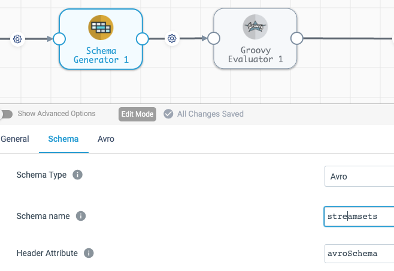

This implementation is Microsoft Azure based.
Register an application in Azure. You should have tenant ID, client ID and client secret. Add that application to Storage Blob Contributors role of the storage account you are going to use.

Upload the following Java libraries to external resources of a Data Collector (or use those provided in the /lib folder in this repo, if you don't feel like collecting the linraries in Maven repository):
|Jar file|
|---|
|arquet-hadoop-1.12.3.jar|
|avro-1.11.1.jar|
|commons-collections-3.2.2.jar|
|commons-compress-1.21.jar|
|commons-configuration2-2.1.1.jar|
|commons-io-2.11.0.jar|
|commons-lang3-3.12.0.jar|
|commons-logging-1.2.jar|
|delta-standalone_2.13-0.5.0.jar|
|delta-storage-2.0.0.jar|
|hadoop-auth-3.3.4.jar|
|hadoop-azure-3.3.4.jar|
|hadoop-azure-datalake-3.3.4.jar|
|hadoop-common-3.3.4.jar|
|hadoop-mapreduce-client-core-3.3.4.jar|
|hadoop-shaded-guava-1.1.1.jar|
|httpclient-4.5.13.jar|
|jackson-annotations-2.13.3.jar|
|jackson-core-2.12.7.jar|
|jackson-core-asl-1.9.13.jar|
|jackson-databind-2.12.7.jar|
|jackson-mapper-asl-1.9.13.jar|
|parquet-avro-1.12.3.jar|
|parquet-column-1.12.3.jar|
|parquet-common-1.12.3.jar|
|parquet-encoding-1.12.3.jar|
|parquet-format-structures-1.12.3.jar|
|parquet-jackson-1.12.3.jar|
|scala-library-2.13.8.jar|
|scala-parallel-collections_2.13-1.0.4.jar|
|shapeless_2.13-2.3.4.jar|
|slf4j-api-1.7.36.jar|
|snappy-java-1.1.8.4.jar|
|stax2-api-4.2.1.jar|
|woodstox-core-5.3.0.jar|

In your new pipeline, add Schema Generator stage followed by Groovy Evaluator stage.

The Schema Generator should have configuration like in the screenshot below:

Add the code from he provided file delta_write.groovy into Groovy Evaluator. In the Groovy code, find the class Сonstants and fill in values for your registered Azure app, storage account and Delta table name. Values in this class don't have to be hardcoded, you can:
- use pipeline parameters functionality for storage account, container, or Delta table;
- use ${runtime:conf} functionality of SDC to pick authorisation values from secured config files.

Your pipeline should look like this: (Origin) -> (Anything Else) -> (Schema Generator) -> (Groovy Evaluator) -> (Trash)
